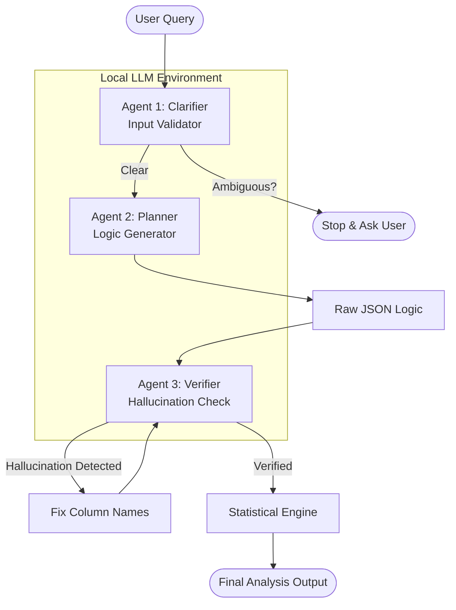

# AI-HOPE: AI-Driven Agent for Precision Medicine

**An open-source implementation of the AI-HOPE system described in *Bioinformatics (2025)*.**

This repository contains the implementation of **AI-HOPE (Artificial Intelligence Agent for High-Optimization and Precision Medicine)**, an LLM-driven system designed to integrate clinical and genomic data through natural language interactions.

## 📖 Overview

The growing complexity of clinical cancer research requires tools that can bridge the gap between complex data and researchers without programming expertise. AI-HOPE addresses this by allowing domain experts to conduct integrative data analyses—such as survival analysis and association studies—using simple conversational queries.

### Core Philosophy
* **Natural Language Interface:** Users provide instructions in plain English (e.g., "Compare survival outcomes between groups").
* **Privacy-First Architecture:** Operates as a **closed system** using locally deployed Large Language Models (LLMs) to ensure HIPAA and GDPR compliance by preventing data leakage.
* **Automated Statistics:** Automatically selects and executes statistical tests (Odds Ratios, Log-rank tests, Hazard Ratios) based on the user's intent.

---

## 🏗️ System Architecture: Multi-Agent Workflow

To ensure high reliability and reduce hallucinations, this implementation uses a **Multi-Agent Architecture** that validates inputs and logic before execution:


Image of multi-agent system architecture




1.  **Agent 1: The Clarifier (Input Validator)**
    * **Role:** Acts as a "Gatekeeper." It analyzes the user's query for ambiguity.
    * **Action:** If a query is too vague (e.g., "Analyze this"), it halts execution and asks the user specific clarifying questions instead of guessing.

2.  **Agent 2: The Planner (Logic Generator)**
    * **Role:** Converts natural language into structured logic.
    * **Action:** It identifies the target variable and cohort conditions, outputting a raw JSON plan (e.g., `Target: KRAS_Mutation`, `Case: Stage IV`).

3.  **Agent 3: The Verifier (Hallucination Check)**
    * **Role:** Acts as a "Code Reviewer."
    * **Action:** It compares the Planner's JSON against the *actual* dataset columns. If the Planner hallucinates a column name (e.g., `KRAS_Status`), the Verifier corrects it to the real column name (`KRAS_mutation_status`) before the code crashes.

4.  **Statistical Engine:**
    * [cite_start]Executes the verified logic to perform prevalence testing, association analysis, and survival modeling[cite: 55].

---

## 📂 Data Formatting Requirements

[cite_start]To ensure the agent can autonomously read your data, datasets must be organized into specific folders containing **three mandatory components** [cite: 74-76]:

1.  **`README.txt`**: A text file providing an overview of the dataset.
2.  **`index.txt`**: A list of key attributes (column headers) available for analysis.
3.  **`data_table.tsv`**: The main tab-delimited data table where rows represent samples and columns represent attributes.

**Directory Structure Example:**
```text
data/
└── your_dataset_name/
    ├── README.txt
    ├── index.txt
    └── data_table.tsv
```

## 🛠️ Installation & Setup
Prerequisites
Python 3.9+
Ollama: This project requires a local instance of Llama3. Download Ollama from ollama.com.


1. Clone the Repository
   * Bash: git clone [https://github.com/UShah1996/AI-HOPE.git](https://github.com/UShah1996/AI-HOPE.git)
   * cd ai-hope-implementation
2. Install Python Dependencies
   * Bash: pip install -r requirements.txt
3. Initialize Local LLM
Ensure Ollama is running and pull the Llama3 model (or the specific model version you intend to use).
   * Bash: ollama run llama3
4. Run the Application
   * Bash: streamlit run src/app.py

## 🧪 Capabilities & Usage
AI-HOPE supports two primary modes of analysis triggered by natural language:

1. Case-Control Studies
* Define cohorts based on clinical criteria and compare them.
* Example Query: "Does the frequency of TP53 mutations differ between early- and late-stage CRC?".
* Mechanism: The system defines "Case" (Late Stage) and "Control" (Early Stage) groups using logical expressions like TUMOR_STAGE is in {T3, T4} and performs an Odds Ratio test .

2. Survival Analysis
* Compare outcomes between groups using Kaplan-Meier curves and Hazard Ratios.
* Example Query: "Compare survival outcomes between FOLFOX-treated patients with and without KRAS mutations..
* Mechanism: The system filters for treated patients, stratifies by mutation status (KRAS_mutation_status is 1 vs 0), and computes progression-free survival statistics .

3. Global Association Scans
* Identify all variables significantly associated with a specific outcome.
* Example Query: "Tell me everything associated with overall survival in colon cancer..
* Mechanism: The agent scans all available variables in the index.txt to identify significant associations.

## Sample Questions

Based on the capabilities described in the paper and the dummy data we generated (which contains TUMOR_STAGE, KRAS_mutation_status, TP53_Mutation, OS_MONTHS, and OS_STATUS), here are sample questions you can ask to test each mode of your AI-HOPE agent.

**1. Survival Analysis (Kaplan-Meier & Hazard Ratios)**

Tests if the agent can generate survival curves and calculate risk.

* Compare survival outcomes for patients with KRAS_mutation_status.
* Does TP53_Mutation affect overall survival?
* Show me the survival curve for TUMOR_STAGE.
* Analyze the survival difference between patients with and without KRAS mutations.

**2. Case-Control Studies (Odds Ratios)**

Tests if the agent can define "Case" vs "Control" groups and check for enrichment.
  * Compare TP53_Mutation frequency in Stage I vs Stage IV.
  * Is KRAS_mutation_status more common in Stage IV compared to Stage I?
  * Does the frequency of TP53 mutations differ between early-stage (Stage I) and late-stage (Stage IV) cancer?
  
(Note: This tests the logic parser's ability to map "early-stage" to specific values if you prompted it, or you can be specific like "Stage I").

**3. Global Discovery (Association Scan)**

Tests the "Loop" function that checks all variables against a target.

* Tell me everything associated with OS_STATUS.
* What variables are linked to TUMOR_STAGE?
* Run a global scan for associations with KRAS_mutation_status.

**4. Complex Logic (Testing the Parser)**

Tests if the system handles parenthetical logic or multi-condition groups.

* Compare survival for patients where TUMOR_STAGE is in {'Stage III', 'Stage IV'} vs {'Stage I', 'Stage II'}.
* Is TP53_Mutation associated with high risk survival groups?

Tip for Best Results:
* Since we are using a local Llama3 model, it works best when you use the exact column names from your dataset (e.g., say KRAS_mutation_status instead of just "KRAS") until we add more advanced synonym mapping.

## 🛡️ Privacy Note
This software is designed for local deployment only. To maintain the security of sensitive clinical data, do not modify the code to send data to external APIs (e.g., OpenAI, Anthropic). The logic extraction is handled entirely by the local Llama3 instance to avoid online data exchange.


## 📚 Reference
This implementation is based on:

AI-HOPE: an AI-driven conversational agent for enhanced clinical and genomic data integration in precision medicine research Bioinformatics, 2025, 41(7), btaf359. https://doi.org/10.1093/bioinformatics/btaf359.