# AI-HOPE: AI-Driven Agent for Precision Medicine

**An open-source implementation of the AI-HOPE system described in *Bioinformatics (2025)*.**

This repository contains the implementation of **AI-HOPE (Artificial Intelligence Agent for High-Optimization and Precision Medicine)**, an LLM-driven system designed to integrate clinical and genomic data through natural language interactions.

## 📖 Overview

The growing complexity of clinical cancer research requires tools that can bridge the gap between complex data and researchers without programming expertise. AI-HOPE addresses this by allowing domain experts to conduct integrative data analyses—such as survival analysis and association studies—using simple conversational queries.

### Core Philosophy
* **Natural Language Interface:** Users provide instructions in plain English (e.g., "Compare survival outcomes between groups").
* **Privacy-First Architecture:** Operates as a **closed system** using locally deployed Large Language Models (LLMs) to ensure HIPAA and GDPR compliance by preventing data leakage.
* **Automated Statistics:** Automatically selects and executes statistical tests (Odds Ratios, Log-rank tests, Hazard Ratios) based on the user's intent.

---

## 🏗️ System Architecture: Multi-Agent Workflow

To ensure high reliability and reduce hallucinations, this implementation uses a **Multi-Agent Architecture** that validates inputs and logic before execution:


Image of multi-agent system architecture

```mermaid
graph TD
    %% Nodes
    User([User Query])
    
    subgraph "Agentic Layer (Llama3)"
        Clarifier[🕵️ Agent 1: Clarifier<br/>Input Validation]
        Planner[🧠 Agent 2: Planner<br/>Logic Generation]
        Verifier[✅ Agent 3: Verifier<br/>Hallucination Check]
    end
    
    subgraph "Execution Layer"
        Parser{Logic Parser}
        Stats[⚙️ Statistical Engine]
        Output([Final Analysis])
    end

    %% Edge Connections
    User --> Clarifier
    
    Clarifier -- "Ambiguous?" --> Stop([⛔ Stop & Ask User])
    Clarifier -- "Clear" --> Planner
    
    Planner -->|Raw JSON| Verifier
    
    Verifier -- "Hallucination Detected" --> Fix[Auto-Fix Columns]
    Fix --> Verifier
    
    Verifier -- "Verified JSON" --> Parser
    Parser --> Stats
    Stats --> Output

    %% Styling
    style Clarifier fill:#f9f,stroke:#333,stroke-width:2px
    style Planner fill:#bbf,stroke:#333,stroke-width:2px
    style Verifier fill:#bfb,stroke:#333,stroke-width:2px
```




1.  **Agent 1: The Clarifier (Input Validator)**
    * **Role:** Acts as a "Gatekeeper." It analyzes the user's query for ambiguity.
    * **Action:** If a query is too vague (e.g., "Analyze this"), it halts execution and asks the user specific clarifying questions instead of guessing.

2.  **Agent 2: The Planner (Logic Generator)**
    * **Role:** Converts natural language into structured logic.
    * **Action:** It identifies the target variable and cohort conditions, outputting a raw JSON plan (e.g., `Target: KRAS_Mutation`, `Case: Stage IV`).

3.  **Agent 3: The Verifier (Hallucination Check)**
    * **Role:** Acts as a "Code Reviewer."
    * **Action:** It compares the Planner's JSON against the *actual* dataset columns. If the Planner hallucinates a column name (e.g., `KRAS_Status`), the Verifier corrects it to the real column name (`KRAS_mutation_status`) before the code crashes.

4.  **Statistical Engine:**
    * [cite_start]Executes the verified logic to perform prevalence testing, association analysis, and survival modeling[cite: 55].

---

## 📂 Data Formatting Requirements

[cite_start]To ensure the agent can autonomously read your data, datasets must be organized into specific folders containing **three mandatory components** [cite: 74-76]:

1.  **`README.txt`**: A text file providing an overview of the dataset.
2.  **`index.txt`**: A list of key attributes (column headers) available for analysis.
3.  **`data_table.tsv`**: The main tab-delimited data table where rows represent samples and columns represent attributes.

**Directory Structure Example:**
```text
data/
└── your_dataset_name/
    ├── README.txt
    ├── index.txt
    └── data_table.tsv
```

## 🛠️ Installation & Setup
Prerequisites
Python 3.9+
Ollama: This project requires a local instance of Llama3. Download Ollama from ollama.com.


1. Clone the Repository
   * Bash: git clone [https://github.com/UShah1996/AI-HOPE.git](https://github.com/UShah1996/AI-HOPE.git)
   * cd ai-hope-implementation
2. Install Python Dependencies
   * Bash: pip install -r requirements.txt
3. Initialize Local LLM
Ensure Ollama is running and pull the Llama3 model (or the specific model version you intend to use).
   * Bash: ollama run llama3
4. Run the Application
   * Bash: streamlit run src/app.py

## 🧪 Capabilities & Usage
AI-HOPE supports three primary modes of analysis triggered by natural language:

### 1. Case-Control Studies
Define cohorts based on clinical criteria and compare them.
* *Example Query:* "Compare the frequency of TP53_Mutation in patients where TUMOR_STAGE is 'Stage IV' versus patients where TUMOR_STAGE is 'Stage I'."
* *Mechanism:* The system defines "Case" (Stage IV) and "Control" (Stage I) groups using logical expressions and performs an Odds Ratio test.

### 2. Survival Analysis
Compare outcomes between groups using Kaplan-Meier curves and Hazard Ratios.
* *Example Query:* "Perform a survival analysis grouping patients by KRAS_mutation_status."
* *Mechanism:* The system filters for patients, stratifies by mutation status, and computes progression-free survival statistics and Hazard Ratios.

### 3. Global Association Scans (Discovery Mode)
Identify all variables significantly associated with a specific outcome.
* *Example Query:* "Run a global association scan to find variables correlated with OS_STATUS."
* *Mechanism:* The agent scans all available variables in the `index.txt` to identify significant associations.

## 🧪 Sample Queries for Testing

### 1. Survival Analysis
*Tests the generation of Kaplan-Meier curves and Hazard Ratios.*

* **Group Comparison:** "Compare survival outcomes between patients with and without `KRAS_mutation_status`." 
* **Simple Grouping:** "Perform a survival analysis grouping patients by `TUMOR_STAGE`."
* **Natural Language:** "Does having a TP53 mutation affect overall survival?"

### 2. Case-Control Studies
*Tests the Odds Ratio calculation and cohort definition logic.*

* **Explicit Cohorts:** "Compare the frequency of `TP53_Mutation` in patients where `TUMOR_STAGE` is 'Stage IV' versus patients where `TUMOR_STAGE` is 'Stage I'."
* **Clinical Question:** "Is `KRAS_mutation_status` more common in late-stage cancer compared to early-stage?"
* **Subset Analysis:** "Compare `BRAF_mutation` frequency in male vs female patients."

### 3. Global Discovery (Association Scan)
*Tests the loop function that scans all variables against a target.*

* **Targeted Scan:** "Run a global association scan to find variables correlated with `OS_STATUS`."
* **Open-Ended:** "Tell me everything associated with `KRAS_mutation_status`."

### 4. Reliability & Safety Tests
*Tests the Multi-Agent architecture (Clarifier and Verifier).*

* **Ambiguity Check:** "Is the data good?" -> *Should trigger a warning asking for clarification.*
* **Hallucination Check:** "Compare survival for `KRAS_Status`." -> *The Verifier should auto-correct `KRAS_Status` to `KRAS_mutation_status`.*
## 🛡️ Privacy Note
This software is designed for local deployment only. To maintain the security of sensitive clinical data, do not modify the code to send data to external APIs (e.g., OpenAI, Anthropic). The logic extraction is handled entirely by the local Llama3 instance to avoid online data exchange.


## 📚 Reference
This implementation is based on:

AI-HOPE: an AI-driven conversational agent for enhanced clinical and genomic data integration in precision medicine research Bioinformatics, 2025, 41(7), btaf359. https://doi.org/10.1093/bioinformatics/btaf359.